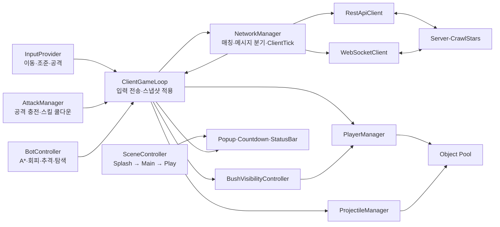

# Crawl Stars

> Unity 기반 서버 권위형 2D 실시간 멀티플레이 액션 클라이언트<br>
> 입력, 매치메이킹, 30Hz 스냅샷 동기화, 전투 표현, 봇 AI, UI, 성능 개선까지 클라이언트 전반 설계 및 구현

<p align="center">
  
  
</p>

## 한눈에 보기

| 항목 | 내용                                                                                |
| --- |-----------------------------------------------------------------------------------|
| 개발 기간 | 2026년 5월 13일 ~ 7월 22일                                                             |
| 담당 | Unity 클라이언트 구조, 게임플레이, 네트워크, UI, 봇, 최적화, 서버 연동                                    |
| 개발 기여 | 클라이언트 저장소 PR 26개 작성, 기능·디자인 PR 25개 병합                                             |
| 코드 규모 | 커스텀 C# 65개, 약 4,000줄, 씬 3개, 프리팹 19개                                               |
| 엔진 | Unity `6000.3.15f1`, URP 2D                                                       |
| 주요 기술 | C#, UniTask, REST, WebSocket, Addressables, Newtonsoft.Json, DOTween              |
| 서버 | [Second-Loop/Server-CrawlStars](https://github.com/Second-Loop/Server-CrawlStars) |

브롤스타즈의 짧고 즉각적인 전투 경험을 네트워크 게임 클라이언트 관점에서 재구성. 서버 상태의 안정적인 표현, 입력 지연과 런타임 할당 감소, 비동기 매칭과 씬 전환의 일관된 흐름에 집중.

## 핵심 플레이 흐름

1. Splash 씬에서 공용 게임 설정과 Addressables 기반 모드·캐릭터 데이터 초기화
2. Main 씬에서 Solo 또는 Team 모드와 캐릭터 선택
3. `POST /matchmaking/join`으로 방, 플레이어, 세션 토큰, WebSocket 경로 수신
4. WebSocket `Ready` 이벤트에서 서버 맵과 전체 참가자 정보 수신
5. Play 씬 Additive 로드와 맵·플레이어 렌더링 후 `ready` ACK 전송
6. 서버 카운트다운 후 입력 전송과 30Hz 스냅샷 반영
7. `GameEnd` 결과에 따른 종료 팝업과 메인 씬 복귀

## 클라이언트 아키텍처



네트워크 계층은 전송과 메시지 해석, 게임 루프는 서버 상태 전달, 플레이어·투사체 매니저는 DTO의 Unity 오브젝트 투영 담당. 씬과 팝업은 게임 상태와 분리된 비동기 흐름으로 관리.

## 특히 신경 쓴 점

### 1. 로컬 프로토타입에서 서버 권위형 구조로 전환

초기 30Hz 로컬 시뮬레이터로 이동, 원·사각형 충돌, 투사체, 피격, 승패 검증. 서버 연동 단계에서 로컬 판정을 제거하고 `ClientGameLoop`는 입력 전송, `PlayerManager`와 `ProjectileManager`는 서버 스냅샷 표현에 집중.

프로토타입 보존보다 검증된 학습과 명확한 책임 경계를 우선. [PR #2](https://github.com/Second-Loop/Client-CrawlStars/pull/2)에서 [PR #6](https://github.com/Second-Loop/Client-CrawlStars/pull/6)의 로컬 검증 후 [PR #12](https://github.com/Second-Loop/Client-CrawlStars/pull/12)에서 서버 권위형 구조로 전환.

### 2. 체감 지연을 줄이는 입력 파이프라인

기본 입력 전송률은 서버 tick과 같은 30Hz. 방향 전환 또는 공격 감지 시 다음 주기까지 기다리지 않고 즉시 전송.

- `NetworkManager`: 실행 순서 `-200`, 게임 로직보다 먼저 수신 큐 처리
- `InputProvider`: 실행 순서 `-100`, `ClientGameLoop.Update`보다 먼저 입력 확정
- `ClientGameLoop`: 고정 주기와 상태 변화 즉시 전송 병행
- `ClientTick`: 1부터 증가하는 입력 시퀀스 전송
- `LastProcessedClientTick`: 서버가 처리한 마지막 입력과 다음 입력 번호 동기화

클라이언트 예측보다 입력 대기와 프레임 순서에서 발생하는 불필요한 지연을 먼저 제거. 근거는 [PR #24](https://github.com/Second-Loop/Client-CrawlStars/pull/24)와 [서버 동기화 커밋](https://github.com/Second-Loop/Client-CrawlStars/commit/7a208eb5c9f5e06511cf725967e9af39c1cb83ae)에 기록.

### 3. 측정 가능한 성능 개선

`BenchMarker`로 입력 감지, 응답 시간, 3초 기준 timeout 손실 비율 시각화. 실제 패킷 손실률이 아닌 입력 후 대응 스냅샷까지의 애플리케이션 체감 지표로 활용.

- 메시지 종류 확인과 실제 DTO 역직렬화를 통합해 메시지당 2회에서 1회로 축소
- 모든 수신 타입을 `SocketMessageDto` 하나로 분기
- `Vector2Dto`를 class에서 struct로 변경해 반복 할당 감소
- 맵 타일, 플레이어, 투사체, 선택 UI에 오브젝트 풀 적용
- Sprite 조회 결과 캐싱으로 반복 `Resources.Load` 방지

측정 도구는 [PR #13](https://github.com/Second-Loop/Client-CrawlStars/pull/13), GC Alloc 개선은 [PR #24](https://github.com/Second-Loop/Client-CrawlStars/pull/24)에 기록.

### 4. 비동기 생명주기와 취소 처리

매칭, WebSocket, 팝업, 씬 로드를 UniTask 기반으로 연결. `MatchingPopup`이 `CancellationTokenSource`를 소유하고 취소 시 매칭 대기 종료와 소켓 정리. 연결별 소켓 인스턴스 분리, 닫기 handshake 3초 timeout, 애플리케이션 종료 시 즉시 abort.

씬 전환 순서는 `다음 씬 로드 → 초기 데이터 적용 → 활성화 → 이전 씬 언로드`. 팝업 결과는 `UniTaskCompletionSource`로 반환하고 열린 순서와 Canvas sorting order를 중앙 관리.

### 5. 맵 규칙과 봇 판단

맵은 서버가 전달한 2차원 타일 배열을 기준으로 렌더링. Ground, Wall, SpawnPoint, Bush, Water를 같은 좌표 변환 규칙으로 처리하고 Wall과 Water는 봇 경로에서 차단.

부시는 BFS로 연결 영역을 번호화해 같은 부시 안의 적만 표시. 아군은 항상 표시하도록 팀 규칙 분리. 로컬 테스트용 봇은 사람 입력과 같은 메시지 경로 사용.

- A*와 Manhattan 휴리스틱 기반 추격·후퇴 경로 탐색
- 출발·목표 타일 기준 경로 결과 캐싱
- 투사체 진행 벡터에 플레이어 위치를 투영해 위험 경로와 회피 방향 계산
- 낮은 체력에서 후퇴, 적이 없으면 이동 가능한 임의 타일 탐색
- 캐릭터별 일반 공격·스킬 사거리와 공통 쿨다운 반영

관련 구현은 [PR #16](https://github.com/Second-Loop/Client-CrawlStars/pull/16), [PR #22](https://github.com/Second-Loop/Client-CrawlStars/pull/22), [PR #23](https://github.com/Second-Loop/Client-CrawlStars/pull/23)에 기록.

### 6. 코드 밖의 계약 관리

REST와 WebSocket 메시지는 [OpenAPI](CrawlStars/Docs/References/API/openapi.yaml), [AsyncAPI](CrawlStars/Docs/References/API/asyncapi.yaml)로 추적. 서버 공용 수치는 `game-config.json`으로 분리하고 Unity 빌드 전처리에서 최신 서버 설정 다운로드와 JSON 검증 수행.

런타임 서버 주소는 Git에서 제외된 `network_config.json`으로 분리. URL 기반 `StreamingAssets` 환경을 위해 `UnityWebRequest` 사용. 게임 설정 로드 후 캐릭터·모드 Addressables 병렬 초기화와 횟수 제한 재시도 적용.

## 포트폴리오로서 보여주는 역량

| 역량 | 프로젝트 근거 |
| --- | --- |
| 게임플레이 구조화 | 입력, 조준, 공격, 쿨다운, 플레이어, 투사체의 역할별 분리 |
| 실시간 네트워크 | REST 매치메이킹, WebSocket lifecycle, Ready ACK, 30Hz snapshot, ClientTick |
| 알고리즘 활용 | A* 길찾기, BFS 부시 영역, 벡터 투영 기반 투사체 회피 |
| Unity 런타임 이해 | Script Execution Order, Additive Scene, Addressables, StreamingAssets, Object Pooling |
| 성능 개선 | 인게임 응답 지표, 단일 역직렬화, struct DTO, 캐시와 풀링 |
| 비동기 UX | 취소 가능한 매칭, await 가능한 팝업, 입력 잠금과 자원 정리 |
| 협업과 문서화 | 25개 병합 PR, PR별 설명과 영상, API 계약과 Excalidraw 흐름도 |

## 개발 철학

| 원칙 | 적용 |
| --- | --- |
| 동작을 먼저 증명하고 책임 재분리 | 로컬 시뮬레이터로 전투 규칙 검증 후 서버 권위형 구조로 전환 |
| 감각보다 측정값 우선 | 인게임 응답 지표와 Profiler 확인 후 역직렬화·DTO 최적화 |
| 비동기 작업의 명확한 소유권 | 팝업은 매칭 취소, 네트워크 계층은 소켓, 씬 컨트롤러는 전환 자원 관리 |
| 리뷰를 통한 엣지 케이스 탐색 | 동시 사망, 입력 재활성화, 플랫폼 경로, 초기화 경쟁, 쿨다운 문제 반영 |
| 불일치 계약의 투명한 기록 | 코드와 API 명세 차이를 추측으로 고정하지 않고 통합 과제로 관리 |

## PR로 보는 개발 과정

| 단계 | 핵심 변화 | PR |
| --- | --- | --- |
| 로컬 전투 검증 | 파일 맵, 입력, 충돌, 투사체, 멀티 플레이어 시뮬레이션 | [#2](https://github.com/Second-Loop/Client-CrawlStars/pull/2), [#3](https://github.com/Second-Loop/Client-CrawlStars/pull/3), [#4](https://github.com/Second-Loop/Client-CrawlStars/pull/4), [#5](https://github.com/Second-Loop/Client-CrawlStars/pull/5), [#6](https://github.com/Second-Loop/Client-CrawlStars/pull/6) |
| 클라이언트 기반 구조 | REST·WebSocket, 씬, 팝업, HP·승패, 공통 SceneHandler | [#7](https://github.com/Second-Loop/Client-CrawlStars/pull/7), [#8](https://github.com/Second-Loop/Client-CrawlStars/pull/8), [#9](https://github.com/Second-Loop/Client-CrawlStars/pull/9), [#10](https://github.com/Second-Loop/Client-CrawlStars/pull/10) |
| 서버 권위형 전환 | 실제 서버 연결, snapshot 표현 구조, 매칭 상태 전이, 공용 설정 | [#11](https://github.com/Second-Loop/Client-CrawlStars/pull/11), [#12](https://github.com/Second-Loop/Client-CrawlStars/pull/12), [#13](https://github.com/Second-Loop/Client-CrawlStars/pull/13), [#14](https://github.com/Second-Loop/Client-CrawlStars/pull/14), [#15](https://github.com/Second-Loop/Client-CrawlStars/pull/15) |
| 플레이 경험 확장 | 봇, 조준, 모드·캐릭터, 팀 표현, 쿨다운, 부시·물 | [#16](https://github.com/Second-Loop/Client-CrawlStars/pull/16), [#17](https://github.com/Second-Loop/Client-CrawlStars/pull/17), [#18](https://github.com/Second-Loop/Client-CrawlStars/pull/18), [#19](https://github.com/Second-Loop/Client-CrawlStars/pull/19), [#20](https://github.com/Second-Loop/Client-CrawlStars/pull/20), [#21](https://github.com/Second-Loop/Client-CrawlStars/pull/21), [#22](https://github.com/Second-Loop/Client-CrawlStars/pull/22), [#23](https://github.com/Second-Loop/Client-CrawlStars/pull/23) |
| 품질과 완성도 | 입력 지연·GC 개선, 아웃게임·인게임 아트 적용 | [#24](https://github.com/Second-Loop/Client-CrawlStars/pull/24), [#25](https://github.com/Second-Loop/Client-CrawlStars/pull/25), [#26](https://github.com/Second-Loop/Client-CrawlStars/pull/26) |

<details>
<summary><strong>전체 PR 목록</strong></summary>

- [#1 SL-4 test PR](https://github.com/Second-Loop/Client-CrawlStars/pull/1) · GitHub·Linear 연결 테스트, 종료 후 미병합
- [#2 파일 기반 맵 제네레이팅](https://github.com/Second-Loop/Client-CrawlStars/pull/2)
- [#3 플레이어 Input 감지 및 이동](https://github.com/Second-Loop/Client-CrawlStars/pull/3)
- [#4 움직임 충돌 처리](https://github.com/Second-Loop/Client-CrawlStars/pull/4)
- [#5 공격 투사체 움직임 및 충돌](https://github.com/Second-Loop/Client-CrawlStars/pull/5)
- [#6 멀티 플레이어 기능 확장](https://github.com/Second-Loop/Client-CrawlStars/pull/6)
- [#7 네트워크 통신 모듈 기반 제작](https://github.com/Second-Loop/Client-CrawlStars/pull/7)
- [#8 씬 이동, 팝업 시스템](https://github.com/Second-Loop/Client-CrawlStars/pull/8)
- [#9 HP, 피격, 승패 시스템](https://github.com/Second-Loop/Client-CrawlStars/pull/9)
- [#10 SceneHandler 추상화, 팝업 Esc 컨트롤](https://github.com/Second-Loop/Client-CrawlStars/pull/10)
- [#11 서버 주소 연결 및 UI 플로우 연동](https://github.com/Second-Loop/Client-CrawlStars/pull/11)
- [#12 클라이언트에서 서버 로직 분리 및 매치메이킹 반영](https://github.com/Second-Loop/Client-CrawlStars/pull/12)
- [#13 입력 이후 서버 메시지까지 레이턴시·손실 비율 벤치마커](https://github.com/Second-Loop/Client-CrawlStars/pull/13)
- [#14 매칭 준비·카운트다운 상태 전이](https://github.com/Second-Loop/Client-CrawlStars/pull/14)
- [#15 클라이언트·서버 연동 마무리](https://github.com/Second-Loop/Client-CrawlStars/pull/15)
- [#16 봇 로컬 프로토타이핑](https://github.com/Second-Loop/Client-CrawlStars/pull/16)
- [#17 조준 시스템](https://github.com/Second-Loop/Client-CrawlStars/pull/17)
- [#18 모드·캐릭터 선택 기능](https://github.com/Second-Loop/Client-CrawlStars/pull/18)
- [#19 팀 간 시각적 구분 강화](https://github.com/Second-Loop/Client-CrawlStars/pull/19)
- [#20 캐릭터 분리 구조화](https://github.com/Second-Loop/Client-CrawlStars/pull/20)
- [#21 공격 및 스킬 쿨타임 시스템](https://github.com/Second-Loop/Client-CrawlStars/pull/21)
- [#22 맵 요소 Bush, Water 추가](https://github.com/Second-Loop/Client-CrawlStars/pull/22)
- [#23 봇 탐색 상태 추가](https://github.com/Second-Loop/Client-CrawlStars/pull/23)
- [#24 클라이언트 체감 레이턴시 감소](https://github.com/Second-Loop/Client-CrawlStars/pull/24)
- [#25 아웃게임 아트 적용](https://github.com/Second-Loop/Client-CrawlStars/pull/25)
- [#26 인게임 아트 적용](https://github.com/Second-Loop/Client-CrawlStars/pull/26)

</details>

## 주요 디렉터리

```text
CrawlStars/
├─ Assets/Scripts/
│  ├─ Core/Controller       입력과 서버 snapshot을 잇는 클라이언트 루프
│  ├─ Core/Player           플레이어 표현, 조준, 공격과 쿨다운
│  ├─ Core/Projectile       투사체 생성·갱신·회수
│  ├─ Core/Map              서버 맵 렌더링과 부시 시야
│  ├─ Core/Simulator        로컬 테스트 봇과 A* 길찾기
│  ├─ Network               REST, WebSocket, DTO와 메시지 분기
│  ├─ Scene                 Additive 씬 전환과 씬별 입력 흐름
│  ├─ Popup, UI             await 가능한 팝업과 전투 UI
│  └─ Utility               풀링, 캐시, 재시도와 공용 도구
├─ Assets/StreamingAssets   런타임 네트워크·게임 설정
└─ Docs/
   ├─ References/API        OpenAPI, AsyncAPI 계약
   └─ FlowCharts            Core, UI, Matching 흐름도
```

## 실행 방법

1. Unity Hub에서 `CrawlStars` 폴더를 Unity `6000.3.15f1`로 열기
2. `CrawlStars/Assets/StreamingAssets/network_config.example.json`을 같은 폴더의 `network_config.json`으로 복사
3. `restBaseUrl`과 `websocketUrl`을 실행 중인 [서버](https://github.com/Second-Loop/Server-CrawlStars) 주소로 변경
4. Build Settings의 첫 씬 `Assets/Scenes/Splash.unity`에서 실행

`network_config.json`은 Git에서 제외. Player 빌드 전 서버 저장소의 최신 `game-config.json` 다운로드와 JSON 검증 수행. 빌드 시 네트워크 연결 필요.

## 현재 통합 과제

- 클라이언트가 사용하는 `ReadyPlayer.CharacterType`, `PlayerData.CharacterType`과 현재 AsyncAPI 간 차이
- AsyncAPI 필수 필드 `MapData.tileSize`와 공용 `GameConfig.TileSize`를 사용하는 클라이언트 간 차이
- 일반 공격과 스킬을 구분하지 않는 현재 `InputMessage` 계약
- 자동화 테스트 부재, Unity 런타임·Profiler·인게임 벤치마커·PR 리뷰 중심 검증

한쪽 구현의 추측보다 API 계약 합의를 우선. 합의 후 DTO와 게임 규칙 동시 갱신 예정.

## 문서

- [Core Flow](CrawlStars/Docs/FlowCharts/Core-Flow.excalidraw)
- [UI Flow](CrawlStars/Docs/FlowCharts/UI-Flow.excalidraw)
- [Matching Flow](CrawlStars/Docs/FlowCharts/Matching-Flow.excalidraw)
- [REST API](CrawlStars/Docs/References/API/openapi.yaml)
- [WebSocket API](CrawlStars/Docs/References/API/asyncapi.yaml)
