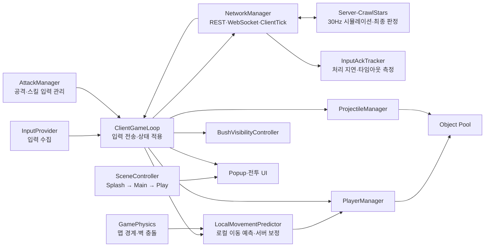

# Crawl Stars

> Unity 기반 서버 권위형 2D 실시간 멀티플레이 액션 게임 - 브롤스타즈 모작<br>
> 서버가 30Hz 시뮬레이션으로 게임 상태를 최종 판정하고, 로컬 예측과 서버 보정으로 조작 반응성을 확보

<p align="center">
  
  
  
  
</p>

<br/>

## 한눈에 보기

| 항목 | 내용                                                                                |
| --- |-----------------------------------------------------------------------------------|
| 개발 기간 | 2026년 5월 13일 ~ 진행 중                                                          |
| 팀 구성 | 클라이언트 1명, 서버 1명 |
| 담당 | 클라이언트 전반, 서버 권위 동기화, 클라이언트 예측·보정, 매치메이킹, 네트워크                    |
| 엔진 | Unity `6000.3.15f1`, URP 2D                                                       |
| 주요 기술 | C#, UniTask, REST, WebSocket, Addressables, DOTween              |
| 서버 | [Second-Loop/Server-CrawlStars](https://github.com/Second-Loop/Server-CrawlStars) |

<br/>

## 핵심 기술

### 1. 서버 권위 모델

클라이언트는 입력 명령만 전송하고 게임 상태를 확정하지 않음. 서버가 30Hz tick에서 입력을 처리하고 권위 상태를 스냅샷으로 반환.

| 구분 | 처리 기준 |
| --- | --- |
| 클라이언트 전송 | `MoveDir`, `AttackDir`, `PressedAttack`, `ClientTick` |
| 서버 최종 판정 | 위치, 충돌, 공격 승인, 투사체, 피해, 사망, 승패 |
| 클라이언트 상태 적용 | `PlayerManager`, `ProjectileManager`, `BushVisibilityController` |
| 로컬 예외 처리 | 내 플레이어의 이동 위치만 최대 0.12초 예측 |

`NetworkManager`가 WebSocket 메시지를 `SocketMessageDto`로 역직렬화하고 `ClientGameLoop`에 스냅샷 전달. `ClientGameLoop`는 플레이어, 투사체, 부시 시야를 각각의 매니저에 분배. 로컬 예측 중에도 공격 승인, HP, 사망 등 전투 결과는 항상 서버 값 적용.

<br/>

### 2. 제한적 이동 예측과 서버 보정

예측 대상은 로컬 플레이어의 위치로 한정. 지속적인 시뮬레이션이나 원격 플레이어 보간 대신, 입력 반응성이 중요한 이동 시작·방향 전환 구간만 보완.

1. `NetworkManager.SendInputAsync`가 `ClientTick`을 증가시키고 `InputSubmitted` 이벤트 발생
2. `ClientGameLoop`가 입력 방향 변경을 감지해 `LocalMovementPredictor` 활성화
3. 마지막 서버 속도와 현재 입력 방향으로 프레임별 이동량 계산
4. `GamePhysics.GetNextPosition`으로 맵 경계와 Wall·Water 충돌 검사
5. 스냅샷 수신 시 서버 위치 변화량을 예측 위치에 반영
6. 서버 ACK, 정지 입력, 사망 또는 0.12초 경과 시 서버 위치로 보정

프레임별 예측 이동량은 `direction × serverSpeed × progress² × deltaTime`으로 계산. 예측 초반 이동량을 낮게 시작해 서버 위치로 되돌아갈 때 발생하는 시각적 오차를 제한.

예측 중 `PlayerManager.ApplySnapshot`은 내 플레이어 transform 갱신만 보류. `LocalMovementPredictor.ObserveSnapshot`은 `nextServerPos - serverPos`를 현재 예측 위치에 더하고, `LastProcessedClientTick >= pendingClientTick`이면 예측 종료 후 서버 위치 적용.

현재 구현은 스냅샷 버퍼 기반 보간이 아니라 로컬 예측과 서버 보정(reconciliation) 구조. 원격 플레이어 위치는 수신한 스냅샷을 즉시 적용.

<br/>

### 3. latest-only 스냅샷 대응

일반 게임플레이 스냅샷은 서버에서 최신 상태 하나만 유지하는 latest-only 방식. 클라이언트는 중간 스냅샷 누락을 정상 조건으로 처리.

- `InputAckTracker`: 높은 `LastProcessedClientTick` 수신 시 그 이하의 pending input을 처리 완료로 제거
- 지연 측정: 정확히 일치하는 `ClientTick`이 남아 있을 때만 왕복 처리 시간 계산
- 타임아웃: ACK가 3초 동안 확인되지 않은 입력만 별도 집계
- `ProjectileManager`: 최신 스냅샷의 투사체 ID 집합과 로컬 Dictionary를 비교해 누락된 투사체 회수

파괴 이벤트 하나에 의존하지 않고 최신 권위 상태와 로컬 상태의 차이를 기준으로 복구.

<br/>

## 빌드 링크 (1.0.0-beta2)

- [[Windows](https://drive.google.com/file/d/1q9JwMjrpYBpcsL2LoUgqRNFU1aqYbsMl/view?usp=sharing)]
- [[MacOS](https://drive.google.com/file/d/1qwz4qqAThpYu0MF8l9U-ReaU2mt3y_8_/view?usp=sharing)]
  - '파일이 손상되었기 때문에 열 수 없습니다.' 혹은 'Gatekeeper 보안 기능' 등으로 앱 실행이 되지 않을 때 다음 명령어 실행 `xattr -dr com.apple.quarantine /path/to/YourGame.app`

<br/>

## 핵심 플레이 흐름

### 1. 인게임 코어 로직 flow


1. 클라이언트에서 매 프레임 이동 방향과 공격 방향 입력 수집
2. 30Hz `ClientTick`에 맞춰 입력을 서버로 전송
3. 서버에서 모든 클라이언트 입력을 수신해 플레이어와 투사체 시뮬레이션
4. 충돌·피격·사망·게임 종료 판정 후 전체 상태 snapshot 생성
5. snapshot을 모든 클라이언트에 전송
6. 클라이언트에서 플레이어와 투사체를 생성·갱신·회수하고 화면에 렌더링

<br/>

### 2. 매치메이킹 flow


1. 각 클라이언트에서 REST 매치메이킹 요청
2. 응답으로 받은 세션 정보와 경로를 사용해 WebSocket 연결
3. 인원 충족 후 서버의 `Ready` 메시지 수신
4. Play 씬으로 이동해 맵과 플레이어 로드·초기화
5. 초기화 완료 후 각 클라이언트에서 `ready` ACK 전송
6. 모든 클라이언트 준비 완료 시 `starting` snapshot 수신
7. 5초 카운트다운 후 `started` snapshot과 함께 인게임 루프 시작

<br/>

## 클라이언트 아키텍처


```mermaid
flowchart LR
    Input["InputProvider\n입력 수집"] --> Loop["ClientGameLoop\n입력 전송·상태 적용"]
    Attack["AttackManager\n공격·스킬 입력 관리"] --> Loop
    Loop --> Network["NetworkManager\nREST·WebSocket·ClientTick"]
    Network <--> Server["Server-CrawlStars\n30Hz 시뮬레이션·최종 판정"]

    Network --> Ack["InputAckTracker\n처리 지연·타임아웃 측정"]
    Network --> Loop

    Loop --> Predictor["LocalMovementPredictor\n로컬 이동 예측·서버 보정"]
    Physics["GamePhysics\n맵 경계·벽 충돌"] --> Predictor
    Predictor --> Players["PlayerManager"]
    Loop --> Players
    Loop --> Projectiles["ProjectileManager"]
    Loop --> Visibility["BushVisibilityController"]

    Players --> Pool["Object Pool"]
    Projectiles --> Pool
    Scene["SceneController\nSplash → Main → Play"] --> UI["Popup·전투 UI"]
    Loop --> UI
```

`NetworkManager`가 서버 메시지 송수신을 담당하고, `ClientGameLoop`가 입력 전송과 스냅샷 적용 순서를 조율. 

게임 상태 표현은 플레이어·투사체·시야 매니저로 분리하고, 로컬 이동 예측은 별도 객체로 구성해 서버 상태 적용과 분리. 

씬 전환과 팝업은 UniTask 기반의 비동기 흐름으로 관리.

<br/>

## 설계와 문제 해결

### 1. 입력 지연을 눈에 보이는 값으로 추적

입력은 서버 tick과 같은 30Hz로 전송하되, 이동 방향 변경이나 공격 발생 시 다음 주기를 기다리지 않고 즉시 전송. 실행 순서는 `NetworkManager → InputProvider → ClientGameLoop`로 고정해 수신 처리와 입력 수집을 같은 프레임에서 안정적으로 연결.

`InputAckTracker`는 각 `ClientTick`의 전송 시각을 기록하고 스냅샷의 `LastProcessedClientTick`과 비교해 서버 처리 시간을 계산. 더 높은 tick이 확인되면 중간 스냅샷이 합쳐진 정상 상황으로 처리하고, 3초 동안 확인되지 않은 입력만 타임아웃으로 집계. `BenchMarker`에서 지연 시간, 대기 입력 수와 타임아웃 비율을 시각화.

네트워크 경로도 별도로 측정. Cloudflare Proxy 경유가 지연에 미치는 영향을 확인한 뒤 DNS Only로 전환해 평균 응답 시간을 약 50ms까지 단축. 예측 도입 전에 전송 주기, 프레임 실행 순서와 네트워크 경로에서 발생하는 지연부터 분리.

<br/>

### 2. 코드와 서버 계약이 함께 바뀌도록 관리

매치메이킹 요청에 선택한 게임 모드와 캐릭터 타입을 포함하고, 응답의 모드·캐릭터·세션 정보가 요청과 일치하는지 검증. Ready 메시지와 게임플레이 스냅샷에서도 같은 `CharacterType`을 사용해 모든 클라이언트가 동일한 참가자 외형을 구성.

조준선은 고정 길이 대신 선택 캐릭터의 일반 공격·스킬 사거리를 반영. 캐릭터 수치와 맵 설정은 서버와 공유하는 `game-config.json`에서 읽어 화면 표현과 서버 판정의 기준을 통일. 관련 변경: 

REST와 WebSocket 메시지 형식은 [OpenAPI](CrawlStars/Docs/References/API/openapi.yaml)와 [AsyncAPI](CrawlStars/Docs/References/API/asyncapi.yaml)로 관리. Unity 빌드 전처리 과정에서 서버 저장소의 최신 게임 설정과 API 문서를 가져와 검증해 클라이언트 코드와 서버 계약의 불일치 방지.

<br/>

### 3. 매칭부터 재시작까지 하나의 비동기 흐름으로 연결

`Main → Play → 전투 → 승패 → Main` 흐름을 에디터 재시작 없이 반복하도록 구성. 공용 매니저는 Splash 씬에서 생성한 뒤 `DontDestroyOnLoad`로 유지하고, 다음 씬을 Additive 방식으로 비동기 로드해 활성화한 다음 이전 씬을 정리.

매칭, WebSocket 연결, 팝업과 씬 전환은 UniTask로 연결. `MatchingPopup`이 취소 토큰을 소유해 매칭 취소 시 대기 요청과 소켓을 함께 정리. 연결마다 WebSocket 인스턴스를 분리하고, 종료 핸드셰이크에는 3초 제한 시간을 적용하며, 애플리케이션 종료 시 즉시 연결 중단.

팝업 결과는 `UniTaskCompletionSource`로 반환. 호출부는 `await PopupManager.ShowAsync` 형태로 사용자 선택을 기다리고, 팝업 표시 순서와 Canvas 정렬은 중앙에서 관리.

<br/>

### 4. 로컬 프로토타입에서 서버 구조로 책임 이전

서버 구현 전 30Hz 로컬 시뮬레이터와 봇으로 이동, 충돌, 공격과 전투 흐름을 우선 검증. A* 경로 탐색, 추격·후퇴, 투사체 회피까지 클라이언트에서 시험한 뒤 서버 구현 완료 시점에 판정 책임을 서버로 이전. 현재 클라이언트는 사람과 봇을 같은 `PlayerData` 스냅샷으로 표현하고, 이전 시뮬레이터는 레거시 코드로 분리.

반복 생성되는 맵 타일, 플레이어와 투사체는 오브젝트 풀로 관리하고 Sprite 조회 결과도 캐싱. 네트워크 메시지는 공통 `SocketMessageDto`로 한 번만 역직렬화하고, `Vector2Dto`를 값 타입으로 변경해 반복 수신 과정의 할당 감소.

<br/>

### 5. 정상 흐름보다 경계 조건을 테스트

Unity Test Framework와 NUnit을 사용해 순수 로직과 Unity 오브젝트 의존 테스트를 분리. 정상 동작뿐 아니라 누락된 스냅샷, 잘못된 설정값, 중복 호출과 맵 경계처럼 상태가 어긋날 수 있는 조건을 회귀 테스트로 보존.

- `GamePhysics`: 맵 경계, 벽·물 충돌, 축별 미끄러짐과 잘못된 맵 데이터
- `ProjectileManager`: 생성·갱신·파괴와 스냅샷에서 사라진 투사체 회수
- `InputAckTracker`: 단조 증가 tick, ACK 지연, 중간 tick 정리와 타임아웃
- `CooldownController`, `MapHelper`: 충전·회복 경계값과 좌표·타일 판정
- `ObjectPooling`, `SpriteCacheHelper`, `Cache`: 재사용, 중복 회수와 씬 전환 후 캐시 초기화

테스트 전후 정적 캐시와 생성 오브젝트를 초기화하고 `LogAssert`로 오류 경로까지 확인. PR 리뷰에서 발견한 동시 사망, 매칭 취소, 초기화 경쟁과 누락 스냅샷도 검증 범위에 포함.

<br/>

## 문제 발생 및 해결 방법

<details>
<summary><strong>1. 방향 전환 시 로컬 플레이어가 순간적으로 끊기는 문제</strong></summary>

### 문제 발생

로컬 이동 예측이 활성화된 동안에는 서버 스냅샷이 화면의 예측 움직임을 덮지 않도록 `PlayerManager`가 내 플레이어의 위치를 즉시 적용하지 않음. 이 상태에서 방향을 전환하면 서버의 ACK가 도착해 예측을 종료하는 순간 캐릭터가 서버 위치로 당겨지는 현상이 발생.

감각적인 현상만으로 원인을 추측하지 않고 예측 과정을 `Start`, `Pending`, `End`로 나눠 기록. 각 단계에서 예측 위치, 서버 권위 위치, 두 위치 사이의 거리와 처리된 `ClientTick`을 비교.

```text
Start   distance=0.0000
Pending distance=0.0662
Pending distance=0.1310
End     distance=0.1699
```

시작 위치는 일치했지만 ACK를 기다리는 동안 오차가 계속 증가했음. 축별 좌표를 비교한 결과, 서버는 새 입력을 처리하기 전까지 이전 방향으로 계속 이동하는 반면 클라이언트의 예측 위치에는 이 서버 이동분이 반영되지 않고 있었음.

첫 번째 원인을 수정한 뒤에도 빠르게 방향을 연속 전환하면 간헐적으로 위치가 되돌아갔음. 로그를 시간순으로 비교하니 `Pending`에서 0.0032였던 오차가 다음 `Start`에서 0.0645로 갑자기 증가. 새 입력을 처리하면서 최신 내부 예측 위치를 아직 갱신되지 않은 한 프레임 이전 `Transform` 위치로 덮어쓰는 것이 두 번째 원인이었음.

### 해결 방법

스냅샷을 받을 때 서버가 이동한 만큼을 현재 예측 위치에도 누적해, 서버의 실제 이동과 새 입력에 대한 로컬 예측이 함께 반영되도록 수정.

```csharp
Vector2 nextServerPos = player.Pos.ToVector2();

if (IsActive) {
    CurPosition += nextServerPos - serverPos;
}

serverPos = nextServerPos;
```

또한 예측이 이미 활성화된 상태에서 방향이 다시 바뀌면 내부 `CurPosition`을 유지하고, 예측을 처음 시작할 때만 현재 `Transform` 위치를 시작점으로 사용하도록 변경.

```csharp
if (!IsActive) {
    CurPosition = currentPosition;
}
```

수정 후 ACK 시점의 보정 거리는 대부분 `0.0032~0.0352` 수준으로 감소. 가속 로직을 제거하지 않고도 큰 위치 보정과 연속 방향 전환 중의 위치 역행을 해소.

</details>

<details>
<summary><strong>2. 30Hz 스냅샷 처리 중 JSON 역직렬화로 발생한 GC 병목</strong></summary>

### 문제 발생

서버 스냅샷을 처리하는 프레임에서 간헐적인 스파이크가 발생. 추측으로 최적화하지 않고 Unity Profiler의 `ProfilerMarker`로 메시지 역직렬화와 스냅샷 적용 구간을 분리해 측정.

<!-- 방법 -->

초기 측정에서 전체 메시지 처리에는 `1.14ms`, `33.9KB`의 GC 할당이 발생. 이 중 스냅샷 적용은 `0.06ms`, `182B`에 불과했고, JSON 역직렬화가 `1.05ms`, `26.8KB`를 차지해 실제 병목임을 확인. 30Hz 기준으로 같은 비용이 반복되면 초당 약 `1MB`의 불필요한 할당이 발생할 수 있는 상태였음.

<!-- 병목capture -->

메시지 타입을 확인하기 위해 전체 JSON을 Envelope로 한 번 읽은 뒤, Payload를 다시 역직렬화하면서 동일한 JSON을 두 번 파싱하고 있었음.

### 해결 방법

먼저 메시지 타입과 Payload를 모두 포함하는 공통 `SocketMessageDto`로 한 번만 역직렬화한 뒤 `Type`에 따라 처리하도록 변경. 중복 파싱을 제거한 결과 전체 처리 시간은 `1.14ms → 0.66ms`, GC 할당은 `33.9KB → 22.5KB`로 감소.

<!-- 해결1capture -->

남은 할당을 확인한 결과 플레이어와 투사체 데이터에서 반복 생성되는 `Vector2Dto`가 주요 원인이었음. 참조 타입으로 유지할 이유가 없는 좌표 DTO를 `class`에서 `struct`로 변경해 개별 객체 할당을 제거.

최종 측정에서는 전체 처리 시간이 `0.25ms`, GC 할당이 `6.3KB`까지 감소. 최초 상태와 비교하면 처리 시간은 약 `78%`, GC 할당은 약 `81%` 줄었고, 30Hz 기준 초당 할당량도 약 `1MB → 189KB`로 감소.

<!-- 최종capture -->

`PlayerData`와 `ProjectileData`처럼 생명주기와 `null` 의미가 필요한 객체는 값 타입으로 무리하게 바꾸지 않음. 프로파일러에서 확인된 병목만 제거하고, 스냅샷 처리 비용이 프레임 예산에서 충분히 작아진 시점에 최적화를 종료.

</details>

<br/>

## 주요 디렉터리

```text
CrawlStars/
├─ Assets/Scripts/
│  ├─ Core/ClientGameLoop.cs 입력 전송, 스냅샷 적용과 예측 수명주기
│  ├─ Core/Character        캐릭터 설정과 선택 상태
│  ├─ Core/Inputs           이동·조준·공격 입력 수집
│  ├─ Core/Player           플레이어 표현, 조준, 공격과 쿨다운
│  ├─ Core/Prediction       로컬 이동 예측, 서버 보정과 충돌 처리
│  ├─ Core/Projectile       투사체 생성·갱신·회수
│  ├─ Core/Map              서버 맵 렌더링과 부시 시야
│  ├─ Core/Mode             게임 모드 설정과 선택 상태
│  ├─ Core/Simulator_Legacy 서버 이전 전 로컬 프로토타입
│  ├─ Network               REST, WebSocket, DTO와 메시지 분기
│  ├─ Scene                 Additive 씬 전환과 씬별 입력 흐름
│  ├─ Popup, UI             await 가능한 팝업, 전투 UI와 ACK 측정
│  └─ Utility               풀링, 캐시, 재시도와 공용 도구
├─ Assets/Editor/Tests       EditMode 단위 테스트
├─ Assets/StreamingAssets   런타임 네트워크·게임 설정
└─ Docs/
   ├─ References/API        OpenAPI, AsyncAPI 계약
   └─ FlowCharts            Core, UI, Matching 흐름도
```
